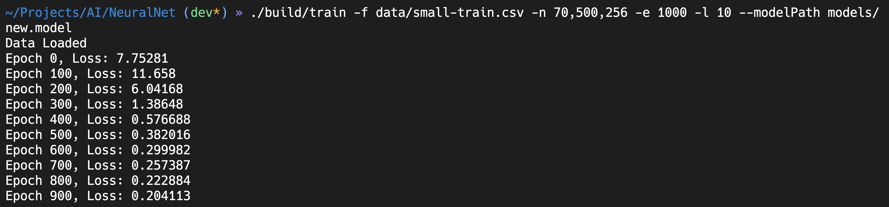
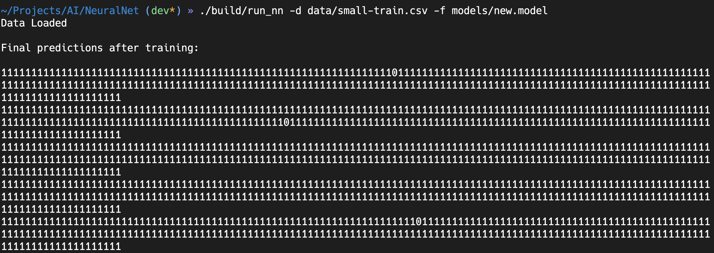

# NeuralNet from Scratch in C++

A simple implementation of most basic Neural Network architecture. Built to be very flexible and customisable and can almost be used as boiler plate for bigger and more complex architecture.

---

## Contents

- [Introduction](#intoduction)
- [Context](#context)
- [Theory](#theory)
- [Process](#process)
- [Result](#results)
- [Conclusion](#conclusion)

---

## Intoduction

This project was created for two reasons.

- To learn both C++ and Neural Networks.

- Proof that Nerual Networks aren't actually "INTELLIGENT".

> Obviously, I don't believe that AI is dumb.
>
> I'm hoping that through this exercise we will become smarter about what AI is at least so far in it evolution

## Context

This project combines two different facets in Computer Science.

1. [Hashing](#hashing)

2. [Neural Network](#neural-network)

### Hashing

**Hashing** means to convert all input into standard string of fixed size.
But the most important property of a hashing function is that while you can generate the hash almost instantly, the reverse should not be possible.

This project uses **SHA256** hashing function which takes in an input and turn it into 256 bit output.

### Neural Network

**Neural Network (NN)** is a Computational Model used in Machine Learning to find patterns in given dataset.
In a NN, there are large number of parameters that can be tuned to generate the desired output.
To train a Neural Net, we must provide it with an input and the output that we'd like to see.

Eventually, after training, we should be able to provide related but previously unseen data to the Network and get some acceptable output.

For our use, we are using the simplest form of NN.

## Theory

We know that NN finds patterns in complex data that hashing should not have.

But, in theory there are only finite number of hashes that a hashing algorithm can generate.
In this case, 256 bits = 2^256 combinations. Which is a huge number but still finite.

So, if we are able to generate more than 1 input for a hash, or, get the correct/partially correct hash for previously unseen input, we are essentially learning the hashing process (and not the hashes and inputs) without the actual hashing function.

And that should be a problem.

Therefore, if we are able to generate the Hash that will mean the NN is not just a pattern recognisation tool but can derive some sense of operations and can also estimate it to some extent at least.

## Process

### Step 1. Creating data to train NN on.

I generated a file containing random string (words) as following.

>tpxeyioddd
>mqujsqefcy
>kbgjfyecks
>qkiqthyajm
>pvlhftvcpl

Converted each word into its binary equivalent (following is the example python code) and also calculated the hash into 256 bits. And stored into a csv file.
From word to binary -> `''.join(format(ord(char), '7b') for char in word)`

>1110100111000011110001100101111100111010011101111110010011001001100100,0001011100100111110110010100100101110001110100100011100000101110101010100110111001101110001000010101101011011001001010100100100000100100001111011011111010010101110000001001001101111111010110011111101000000000100100000101100100110011110000100001110001000010
>1101101111000111101011101010111001111100011100101110011011000111111001,1010011100010011001010111011100110111000101001001110101010001110100011010101110001100111111001110111000010110100001101101001111101110010000000011000010001110111110111000111101101101111011000110000011100000100101100011011101100010100111001001111011010011000
>1101011110001011001111101010110011011110011100101110001111010111110011,1100011101001001111010111100010001010001010110001101101011101100110010101001100000010011000101101000111011100010011001100111111110100011011111100111101001010000011110000001000001110000011011011001111110000101010000001100101011001010001101101101100010000110
>1110001110101111010011110001111010011010001111001110000111010101101101,1001011110110111011001010010000000001000111100001110001010100110100101011011101101001101100100100010010100111011111101011100000011110011101000011100010000111000010101001010001000110111001011001010100110100001010001001100101110011101110010100001000100100000
>1110000111011011011001101000110011011101001110110110001111100001101100,1110000101101010001011110100110000000100110001111111010011110110011100011000010100110000011010110111100000111100110111101110011011111000110100000010001001011010010101101010011110101010100011010110001011000111001111111001110100011010101101000110100000101011

Here the first value will be the input of size 70 and second value will be the output of size 256.

### Step 2: Writing NN from Scratch.

I wanted to write NN from scratch because I only needed a simple implementation and wanted to learn what exactly goes on in a NN.
So I decided to write it in cpp, because of its raw speed.

## Results

### Training

The Network I am building has 70 input nodes, 500 nodes in only one layer of hidder layer, and finally 256 nodes for the output. This network is trained for 1000 epochs with learning rate 10. The loss was minimised to 0.204%.

### Predictions

1. When training data was repeated.

2. When test data was introduces.

### How to Read

I have made the output such that, for each bit of the hash that is predicted correctly, the output is 1. And 0 for when it is wrong.

### Observation

1. The Loss value was minimised lower than 0.204%
2. Predicted hash for previously seen data was mostly accurate.
3. Predicted hash for previously unseen data was completely useless.

## Conclusion

As seen from the output images I have shown, we can deduce that the network was infact able to learn from the training data. But, that learning was not based on any real knowledge. We can say so because prediction for the data that it did not see during the training was effectivally as good a any random guess.
